<h1 align="center">dotm5</h1>

<p align="center"></p>

<p align="center"></p>

---

## What I Like Building

I am drawn to tools that sit close to real workflows: importing things, reconstructing things, validating formats, and turning experiments into something usable without making the tool bigger than the problem.

- Graphics tooling: Blender add-ons, Unreal asset workflows, map recovery, material reconstruction, and diagnostics that make messy exports easier to reason about.
- Image pipelines: HDR authoring, gain-map HEIC, Apple compatibility, local encoding, preview tooling, and metadata checks.
- Numerical experiments: classical schemes, neural correction models, and small PDE experiments that are closer to notebooks than polished products.

Some repositories are just little instruments for a narrow task. That is usually intentional.

## A Few Anchors

[UModel_Tools_Next](https://github.com/dotm5/UModel_Tools_Next) is the graphics corner: a maintained Blender workflow for Unreal Engine mesh and map importing.

[LumaHEIC](https://github.com/dotm5/LumaHEIC) is the image pipeline corner: local HDR gain-map HEIC generation and validation.

[kan-weno-solver](https://github.com/dotm5/kan-weno-solver) is the numerical corner: an archived experiment combining WENO5 with KAN-style correction.

---

## Working Bias

```text
Local-first when possible
Small tools over dashboards
Useful experiments over polished demos
Readable pipelines over magic
```
